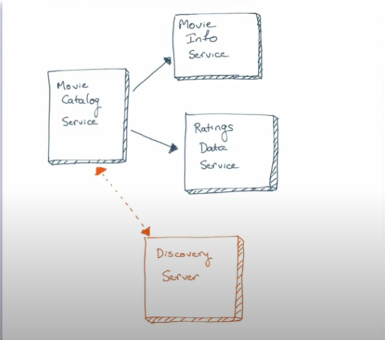

# Distributed application built with Spring Cloud 

This repository was initially created to demonstrate how to split sample Spring application into microservices.
To achieve that goal we use some technologies 
from the [Spring Cloud Netflix](https://github.com/spring-cloud/spring-cloud-netflix) technology stack. Followed course is [microservices tutorial](https://www.youtube.com/watch?v=y8IQb4ofjDo&list=PLqq-6Pq4lTTZSKAFG6aCDVDP86Qx4lNas) of Java Brains. Thanks a lot to Koushik Kothagal and [Java Brains](https://javabrains.io/) for this awesome course!

## Understanding Movie Catalog application

## Starting services locally

Every microservice is a Spring Boot application and can be started locally using IDE or `../mvnw spring-boot:run` command. Please note that supporting services (Discovery Server) must be started before any other application (Movie Catalog, Movie Info, Ratings Data).
If everything goes well, you can access the following services at given location:
* Discovery Server - http://localhost:8761
* Movie Catalog - http://localhost:8081/catalog/{userId}
* Movie Info - http://localhost:8082/movies/{movieId}
* Ratings Data - http://localhost:8083/ratings/user/{userId}
* Hystrix Dashboard - Go to http://localhost:8081/hystrix. Then put 'https://localhost:8081/actuator/hystrix.stream' to the textbox on the middle.
